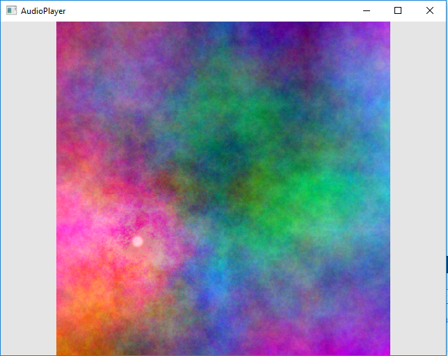

# SpaceFillingCurveAudioPlayer
This will eventually use a space filling curve to map image pixel data to audio stream and output it.

This is a work in (*slow*) progress. Right know all I can do is display the image, highlite a location on the image (using a simple forward lighting effect), calculate a Hemolton Curve, move the highlighting effect along this cureve, and render some realtime audio. 

# Installation
This uses Qt and Qt only, hence it shoud run fine in Qt creator.

# Screenshots
There isn't mutch to show yet and Images are a terible way of demonstrating an audio generator but I uploded one anyway: 
